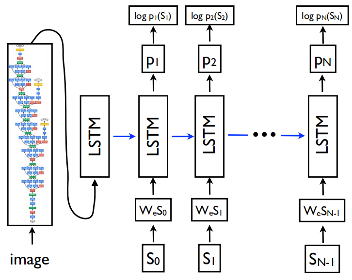
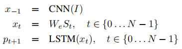
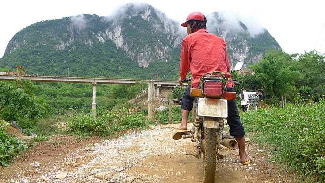

# NIC model
 - A pytorch implementation of "[Show and Tell: A Neural Image Caption Generator](https://www.cv-foundation.org/openaccess/content_cvpr_2015/html/Vinyals_Show_and_Tell_2015_CVPR_paper.html)".
 - Add SCST training from "[Self-critical Sequence Training for Image Captioning](https://openaccess.thecvf.com/content_cvpr_2017/html/Rennie_Self-Critical_Sequence_Training_CVPR_2017_paper.html)".
 - Clear and easy to learn.

## Environment
 - Python 3.7
 - Pytorch 1.3.1

## Method
### 1. Architecture

### 2. Main Process

## Usage
### 1. Preprocessing
Extract image features by ResNet-101 (denoted as **grid-based features**) and process coco captions data (from [Karpathy splits](https://cs.stanford.edu/people/karpathy/deepimagesent/caption_datasets.zip)) through `preprocess.py`. Need to adjust the parameters, where `resnet101_file` comes from [here](https://drive.google.com/drive/folders/0B7fNdx_jAqhtbVYzOURMdDNHSGM). Image features can also be obtained from [here](https://github.com/peteanderson80/bottom-up-attention) or extracted using [ezeli/bottom_up_features_extract](https://github.com/ezeli/bottom_up_features_extract) repository (from [Bottom-Up Attention](https://openaccess.thecvf.com/content_cvpr_2018/html/Anderson_Bottom-Up_and_Top-Down_CVPR_2018_paper.html) paper, using fixed 36 features per image, denoted as **region-based features**).

This project is not limited to the MSCOCO dataset, but you need to process your data according to the data format in the `preprocess.py` file.

### 2. Training
 - First adjust the parameters in `opt.py`:
    - train_mode: 'xe' for pre-training, 'rl' for fine-tuning (+SCST).
    - learning_rate: '4e-4' for xe, '4e-5' for rl.
    - resume: resume training from this checkpoint. required for rl.
    - other parameters can be modified as needed.
 - Run:
    - `python train.py`
    - checkpoint save in `checkpoint` dir, test result save in `result` dir.

### 3. Test
 - `python test.py -t model.pth -i image.jpg`
 - only applicable to the model trained by grid-based features.
 - for region-based features, you can first extract the image feature through [ezeli/bottom_up_features_extract](https://github.com/ezeli/bottom_up_features_extract) repository, and then simply modify the `test.py` file to use.

## Result
### Evaluation metrics
*XE* represents Cross-Entropy loss, and *+SCST* means using reinforcement learning to fine-tune the model (using CIDEr reward).

|features|training|Bleu-1|Bleu-2|Bleu-3|Bleu-4|METEOR|ROUGE_L|CIDEr|SPICE|
|:---:|:---:|:---:|:---:|:---:|:---:|:---:|:---:|:---:|:---:|
|grid-based|XE|71.9|55.0|41.2|30.9|24.7|53.0|94.7|17.8|
|grid-based|+SCST|75.0|57.4|41.9|30.2|24.9|53.8|103.1|17.9|
|region-based|XE|72.5|55.8|42.0|31.7|25.2|53.7|97.0|17.9|
|region-based|+SCST|75.5|58.1|42.7|30.9|25.2|54.3|105.4|18.4|

### Examples

||
|:---:|
|a man is sitting on a motorcycle.|
